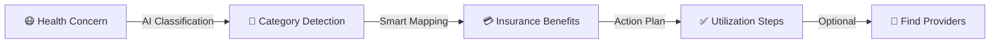

<div align="center">

# 🏥 Healix AI

### Your Intelligent Health Benefits Assistant

*Transforming health concerns into actionable insurance benefits with AI-powered precision*

[](https://healix-ai-kappa.vercel.app)
[](LICENSE)
[](https://reactjs.org/)
[](https://www.typescriptlang.org/)


[✨ Features](#-features) • [🎯 Demo](#-demo-flow) • [🚀 Quick Start](#-quick-start) • [🧠 AI Integration](#-ai-integration) • [📸 Screenshots](#-screenshots)

</div>

---

## 🎭 The Problem We Solve

Ever felt confused about which health benefits apply to your specific condition? **Healix AI** bridges the gap between health concerns and insurance benefits with intelligent classification and actionable 3-step utilization plans.



### What Makes It Special?

- ** Smart Classification**: Gemini AI categorizes health concerns into 15+ medical specialties
- ** Indian Context**: Benefits with realistic INR coverage amounts (₹1,000 - ₹50,000)
- ** Action-Oriented**: 3-step plans focusing on benefit *utilization*, not claims processing
- ** Zero Backend**: Fully client-side with localStorage persistence
- ** Stunning UI**: Glassmorphism, dark mode, and Lottie animations

---

## Features

<div align="center">

| Feature | Description | Status |
|---------|-------------|--------|
|  **AI Classification** | Natural language understanding via Gemini AI | ✅ Live |
|  **Benefit Cards** | Insurance-style coverage with INR amounts | ✅ Live |
|  **Action Plans** | 3-step utilization guides (Access → Verify → Use) | ✅ Live |
|  **Provider Search** | Location-based doctor recommendations | ✅ Live |
|  **Dark Mode** | System-aware theme switching | ✅ Live |
|  **Offline Support** | Recent queries cached locally | ✅ Live |
|  **Lottie Animations** | Interactive loading states | ✅ Live |
|  **Privacy First** | No data sent to servers | ✅ Live |

</div>

---

##  Demo Flow

### 1️⃣ Classification Stage
```
User Input: "I have severe tooth pain and sensitivity"
        ↓
   AI Processing
        ↓
Category: Dental | Confidence: 95%
Reasoning: Acute dental symptoms requiring specialist care
```

### 2️⃣ Benefits Display
```
┌─────────────────────────────────────────┐
│ 🦷 Emergency Dental Care                │
│ Coverage: Up to ₹5,000 per incident     │
│ • Immediate pain relief consultations   │
│ • Root canal treatments covered         │
│ • 24/7 emergency dental hotline         │
└─────────────────────────────────────────┘
```

### 3️⃣ Action Plan
```
Step 1: Access → Book emergency dental appointment via app
Step 2: Verify → Show digital insurance ID at clinic reception  
Step 3: Use → Receive cashless treatment, log visit for records
```

---

## 🚀 Quick Start

### Prerequisites
- Node.js 16+ installed
- Google Gemini API key ([Get one here](https://makersuite.google.com/app/apikey))
- Model - Gemini 2.5 Flash

### Installation

```bash
# Clone the repository
git clone https://github.com/Trideep-2k26/Healix-AI.git
cd Healix-AI

# Install dependencies
npm install

# Create environment file
cat > .env << EOL
VITE_GEMINI_API_KEY=your_gemini_api_key_here
VITE_USE_MOCK_AI=false
EOL

# Start development server
npm run dev
```

Open [http://localhost:5173](http://localhost:5173) to see the magic! ✨

### Build for Production
```bash
npm run build    # Creates optimized bundle in dist/
npm run preview  # Preview production build locally
```

---

## 🧠 AI Integration

### Classification Prompt Engineering

**Evolution Journey:**

| Iteration | Approach | Issue | Solution |
|-----------|----------|-------|----------|
| v1 | Simple category matching | Verbose output | Added JSON constraint |
| v2 | 4 fixed categories | Limited scope | Expanded to 15+ specialties |
| v3 | Structured JSON | Hallucinations | Added validation layer |

**Final Prompt (Classification):**
```javascript
const prompt = `You are a medical classification AI for INDIAN healthcare.

VALIDATION: Determine if this is genuine health concern.
REJECT: Test words, non-medical topics
ACCEPT: Physical symptoms, medical conditions

Return ONLY valid JSON:
{
  "category": "Gastroenterology",
  "issue_summary": "brief description", 
  "confidence": 0.9,
  "reasoning": "why this specialty"
}

Health concern: "${query}"`;
```

**Benefits Generation Prompt:**
```javascript
const prompt = `Generate Indian health insurance BENEFIT CARDS.
Issue: "${issue}" | Category: ${category}

Create 2-4 benefit objects.
OUTPUT: ONLY JSON array. Each:
{
  "title": "Benefit Name",
  "coverage": "Up to ₹X per year",
  "description": "What's covered"
}

Rules:
✓ Realistic INR ranges (₹1,000–₹50,000)
✓ Focus on access, consultations, screenings
✓ Indian context, insurance terminology
✗ No claims/reimbursement mentions`;
```

### Fallback Strategy
```typescript
try {
  const aiResult = await geminiAPI.classify(query);
  return aiResult;
} catch (error) {
  if (VITE_USE_MOCK_AI) return mockClassification;
  throw new Error('AI unavailable. Enable mock mode.');
}
```

---

##  Architecture

### Component Tree
```
App (Router + Theme)
├── Layout (Header + Nav)
├── Pages/
│   ├── Landing (Hero + Features)
│   ├── Classification (Input + AI)
│   ├── Benefits (Card Grid)
│   └── ActionPlan (3-Step + Helpers)
├── Components/
│   ├── HeroSection
│   ├── FloatingChatWidget
│   └── FullScreenLoader
└── Services/
    └── AIService (Gemini Integration)
```

### State Management
```typescript
// Global Context (AppContext.tsx)
interface AppContextType {
  theme: 'light' | 'dark';
  userLocation: string | null;
  recentQueries: ClassificationResult[];
  toggleTheme: () => void;
}

// Route State Passing
navigate('/benefits', {
  state: { classification, issue, location }
});
```

### Data Layer
```typescript
// Mock Benefits (4 predefined categories)
mockBenefits: {
  Vision: [...],
  Dental: [...],
  OPD: [...],
  'Mental Health': [...]
}

// AI-Generated Benefits (11+ dynamic categories)
AIService.generateBenefits(issue, category) → BenefitCard[]
```

---

##  Tech Stack

<div align="center">


</div>

### Full Stack

| Category | Technology | Why? |
|----------|------------|------|
| **Frontend** | React 18 + TypeScript | Type-safe component architecture |
| **Styling** | Tailwind CSS | Utility-first with custom design system |
| **Routing** | React Router v6 | Modern client-side navigation |
| **AI** | Google Gemini AI | Advanced NLP for medical classification |
| **Animations** | Lottie React | Lightweight vector animations |
| **Icons** | Lucide React | 1000+ consistent open-source icons |
| **Build** | Vite | 10x faster than webpack |
| **Deployment** | Vercel | Edge network with automatic SSL |

---

## 📸 Screenshots

<div align="center">

### 🌟 Landing Page


### 🤖 Classification Interface


### 💳 Benefits Grid


### 📋 Action Plan


### ⚠️ 404 Error


</div>

---

## ⚠️ Known Limitations

### Current Challenges

1. **🔍 Vague Input Handling**
   - **Issue**: "I don't feel good" defaults to General Medicine
   - **Planned**: Add clarifying question UI ("Did you mean...?")

2. **📍 Location Dependency**
   - **Issue**: Doctor suggestions only work with Indian cities
   - **Future**: IP-based detection + global provider network

3. **📦 Bundle Size**
   - **Current**: ~1.8MB (Lottie animations)
   - **Optimization**: Dynamic imports for animation files

### Improvement Roadmap

- [ ] Multi-step symptom checker workflow
- [ ] Real hospital/clinic API integration
- [ ] PWA with offline mode
- [ ] Hindi + regional language support
- [ ] Voice input for accessibility

---

## 🚀 Deployment

### Vercel (Recommended)

```bash
# One-click deploy
vercel

# Environment variables in dashboard:
VITE_GEMINI_API_KEY=your_api_key
VITE_USE_MOCK_AI=false
```

### Other Platforms

**Netlify:**
```toml
# netlify.toml
[[redirects]]
  from = "/*"
  to = "/index.html"
  status = 200
```

**Docker:**
```dockerfile
FROM node:18-alpine
WORKDIR /app
COPY package*.json ./
RUN npm install
COPY . .
RUN npm run build
CMD ["npm", "run", "preview"]
```

---

## 🤝 Contributing

We love contributions! Here's how to get started:

1. Fork the repo
2. Create your branch (`git checkout -b feature/awesome-feature`)
3. Commit changes (`git commit -m 'Add awesome feature'`)
4. Push (`git push origin feature/awesome-feature`)
5. Open a Pull Request

### Development Guidelines

- Follow TypeScript best practices
- Add PropTypes for all components
- Write unit tests for new features
- Update documentation for API changes

---

## 📄 License

MIT License - see [LICENSE](LICENSE) for details

---

## 💬 Support & Community

<div align="center">

[](https://github.com/Trideep-2k26/Healix-AI/issues)
[](https://github.com/Trideep-2k26/Healix-AI/stargazers)
[](https://github.com/Trideep-2k26/Healix-AI/network/members)

</div>

- **📧 Email**: [Contact Developer](mailto:makaltrideep@gmail.com)

---

<div align="center">

### ⭐ Star This Repo

*If Healix AI helped you understand AI-powered health benefits, give it a star!*

**Made with ❤️ by Trideep using React, TypeScript & Google Gemini AI**

[↑ Back to Top](#-healix-ai)

</div>
